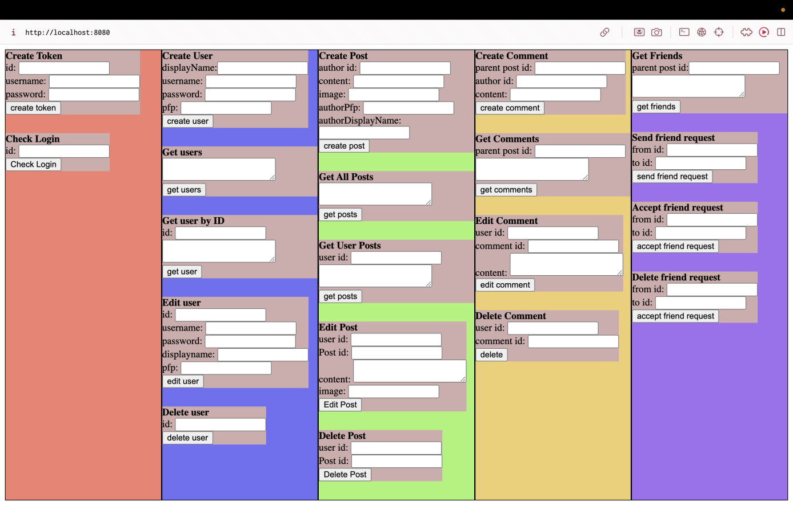
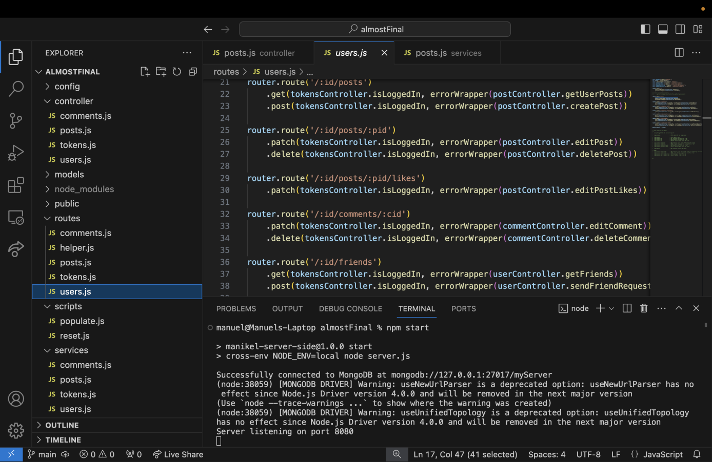

## server
<br>

android app: [link](https://github.com/MikeShlapakov/Manikel-android-app/tree/Part3) <br>
web app: [link](https://github.com/MikeShlapakov/Manikel-web-app/tree/Part3) <br>

<br>
nodejs server used to keep track of users, posts. and to handle user queries, commands.
makes main use of mongoose, express, body-parser and jsonwebtoken. <br><br>

#### features
- holds an index.html site to try out the server's api (lacks a little of maintenance)
- handles errors correctly, server never falls flat (```services/helper.js```)
- makes use of tokens to validate queries
- processes images up to 5MB
- holds 2 scripts to make testing easy peasy, <br>
  ``npm run reset`` drops the db, <br>
  `npm run populate` creates users and posts for each
- for even easier testing, when creating a new user you get 7 friend requests from random ppl
<br>

the amount of posts shown on screen can be easily changed:
```
const getFeedPosts = async (req, res) => {

    const user = await userService.getUser(req.params.id);

    let userFriends = [];
    
    if (user && user.friends) {
        userFriends = user.friends.map(friendId => friendId.toString());
    }

    console.log(userFriends);
    const postsFriends = await postService.getTargetPosts(userFriends, 20);
   
    const postsStrangers = await postService.getNonTargetPosts(userFriends, 5);

    res.json([...postsFriends, ...postsStrangers]);
}
```

<br>


if on ``MACOS``, change the package.json to look like this
```
{
  "name": "manikel-server-side",
  "version": "1.0.0",
  "description": "Our implementation of the server for the Facebook-like social network",
  "main": "index.js",
  "scripts": {
    "start": "cross-env NODE_ENV=local node server.js",
    "populate": "cross-env NODE_ENV=local node scripts/populate.js",
    "reset": "cross-env NODE_ENV=local node scripts/reset.js",
    "test": "cross-env NODE_ENV=test node server.js"
  },
  "keywords": [],
  "author": "",
  "license": "ISC",
  "dependencies": {
    "body-parser": "^1.20.2",
    "cors": "^2.8.5",
    "custom-env": "^2.0.2",
    "dotenv": "^16.4.5",
    "express": "^4.18.3",
    "jsonwebtoken": "^9.0.2",
    "mongodb": "^6.4.0",
    "mongoose": "^8.2.1"
  },
  "devDependencies": {
    "cross-env": "^7.0.3"
  }
}
```
<br>

if on ``WINDOWS``
```
{
  "name": "manikel-server-side",
  "version": "1.0.0",
  "description": "Our implementation of the server for the Facebook-like social network",
  "main": "index.js",
  "scripts": {
    "start": "SET NODE_ENV=local && node server.js",
    "populate": "SET NODE_ENV=local && node scripts/populate.js",
    "reset": "SET NODE_ENV=local && node scripts/reset.js",
    "test": "SET NODE_ENV=test && node server.js"
  },
  "keywords": [],
  "author": "",
  "license": "ISC",
  "dependencies": {
    "body-parser": "^1.20.2",
    "cors": "^2.8.5",
    "custom-env": "^2.0.2",
    "dotenv": "^16.4.5",
    "express": "^4.18.3",
    "jsonwebtoken": "^9.0.2",
    "mongodb": "^6.4.0",
    "mongoose": "^8.2.1"
  },
  "devDependencies": {
    "cross-env": "^7.0.3"
  }
}
```
<br>

#### To run:
1. npm i
2. npm run reset
3. npm run populate
4. npm run
<br>

>  just make sure you have mongod running or else the server will not want to run.

<br>

### Images 




<br><br>

## PART4

<br>

<pre>

Manuel: Couldn't compile with CMakeLists, because of an error with pthread, <br> 
I don't understand how to link the lib using CMakeLists. <br>
  
commands I used to compile both server and client files: <br>

to compile server.cpp:  g++ -o server server.cpp functions.cpp -lpthread -std=c++11 <br>
to compile client.cpp:  g++ -o client client.cpp <br>


> just make sure you first run server and afterwards run the client <br>
> likewise, first exit the client and afterwards the server or else the port will be left hanging
<br>
is the hanging port something that could be fixed?

</pre>
<br><br><br><br><br><br>


